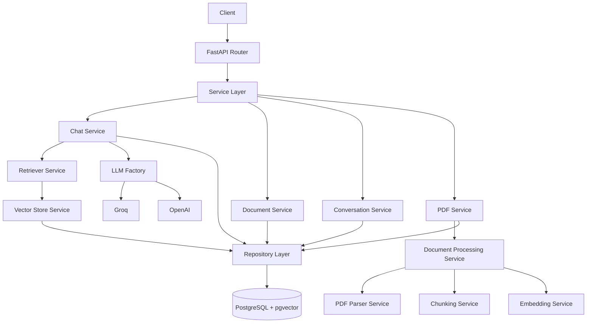

# 📄 Smart PDF Research Assistant

A production-ready Retrieval-Augmented Generation (RAG) backend built completely **from scratch without LangChain**, demonstrating the underlying engineering behind modern LLM applications.

The system processes PDF documents, generates semantic embeddings, stores vectors in **PostgreSQL + pgvector (Supabase)**, retrieves the most relevant document chunks using vector similarity search, and generates grounded responses through configurable LLM providers while preserving conversation history and source attribution.

---

# 🏗️ Architecture & Engineering Highlights

This project was intentionally implemented without relying on high-level RAG frameworks to demonstrate a deep understanding of backend engineering, software architecture, vector databases, asynchronous programming, and Retrieval-Augmented Generation systems.

---

# 🛠 Tech Stack

| Layer | Technology |
|--------|------------|
| Backend | FastAPI (Async) |
| ORM | SQLAlchemy Async |
| Database | PostgreSQL |
| Vector Database | pgvector (Supabase) |
| Embedding Model | Cohere `embed-english-v3.0` |
| LLM Providers | Groq & OpenAI |
| Dependency Management | FastAPI Dependency Injection |
| Database Migration | Alembic |
| Deployment | Render + Supabase |

---

# 🚀 Technical Achievements

- Architected an end-to-end **Retrieval-Augmented Generation (RAG)** system completely from scratch without LangChain.
- Built an asynchronous backend using **FastAPI** and **SQLAlchemy Async** for efficient concurrent request handling.
- Designed a complete **PDF Processing Pipeline** including parsing, intelligent chunking, embedding generation, semantic indexing, and retrieval.
- Implemented semantic search using **PostgreSQL + pgvector (Supabase)** with cosine similarity and metadata filtering.
- Built configurable **LLM Provider Abstraction** supporting both **Groq** and **OpenAI** through a Factory Pattern.
- Designed conversation memory that automatically associates uploaded documents with conversations while preserving chat history.
- Implemented source attribution by returning document identifiers and page numbers for every generated response.
- Deployed the complete application on **Render** using **Supabase PostgreSQL + pgvector** as the production vector database.

---

# 🏛 Software Architecture

The backend follows a **Layered Architecture** with clear separation between the presentation, business, persistence, and infrastructure layers. Business logic is encapsulated within services, while all database interactions are delegated to repositories, ensuring loose coupling and maintainable boundaries.



Each layer has a well-defined responsibility:

- **Presentation Layer** handles HTTP requests and delegates work to the application services.
- **Service Layer** contains the business logic and orchestrates document processing, retrieval, conversations, and LLM interactions.
- **Repository Layer** abstracts all persistence operations, preventing business logic from depending on database implementations.
- **Infrastructure Layer** provides vector storage through **PostgreSQL + pgvector**, enabling efficient semantic search while remaining transparent to the business layer.

This separation of concerns improves maintainability, testability, scalability, and makes individual components easy to replace or extend without affecting the rest of the system.

---

# ⚙️ Engineering Decisions

Instead of relying on high-level abstractions, every major component was designed manually to maximize flexibility and expose the underlying engineering behind modern LLM systems.

Key architectural decisions include:

- Manual implementation of the complete RAG pipeline.
- Separation between API, Services, and Repositories.
- PostgreSQL + pgvector instead of introducing a dedicated vector database.
- Dependency Injection for loose coupling.
- Asynchronous database operations.
- Swappable LLM providers through a Factory Pattern.
- Stateless business services with shared singleton infrastructure services.
- Metadata-aware vector retrieval.
- Conversation-to-document association instead of repeatedly sending document identifiers.

---

# 📐 SOLID Principles Applied

### SRP — Single Responsibility Principle

Each service owns a single business responsibility.

Examples include:

- PDF Parsing
- Chunk Generation
- Embedding Generation
- Vector Retrieval
- Conversation Management
- Chat Orchestration

---

### OCP — Open/Closed Principle

The application is open for extension without modifying existing business logic.

Examples:

- Adding a new LLM provider.
- Replacing the embedding provider.
- Replacing the vector database implementation.

---

### DIP — Dependency Inversion Principle

Business logic depends on abstractions rather than concrete implementations through FastAPI Dependency Injection, reducing coupling and improving maintainability.

---

# 🎯 Design Patterns Applied

## Repository Pattern

Encapsulates all persistence logic while keeping business services independent from database implementation.

---

## Factory Pattern

`LLMFactory` dynamically creates the configured LLM provider (Groq or OpenAI) without changing application logic.

---

## Dependency Injection (DI)

FastAPI dependencies inject repositories and services, improving modularity, testing, and maintainability.

---

## Service Layer Pattern

Business logic is isolated from API controllers, keeping routes lightweight and responsibilities well separated.

---

## Singleton Services

Expensive infrastructure services such as:

- Embedding Service
- PDF Parser
- Chunking Service

are instantiated once and shared across requests through FastAPI Dependency Injection, avoiding unnecessary object recreation while keeping the services stateless.

---

# 📂 Project Structure

```
app
├── api
├── core
├── database
├── entities
├── repositories
├── services
├── llms
├── models
└── main.py
```

The project structure emphasizes clear responsibility boundaries and maintainable service-oriented organization.

---

# 🧠 Why No LangChain?

Rather than depending on framework abstractions, the entire RAG workflow was implemented manually to demonstrate understanding of:

- Retrieval-Augmented Generation (RAG)
- Semantic Search
- Vector Databases
- Embedding Lifecycle
- Prompt Construction
- Conversation Memory
- Software Architecture
- Design Patterns
- Dependency Injection
- Asynchronous Backend Development

This approach provides full control over every stage of the pipeline while exposing the engineering concepts hidden behind high-level frameworks.

---

# ☁️ Deployment

- Backend API → Render
- PostgreSQL + pgvector → Supabase
- Async SQLAlchemy
- Production-ready FastAPI deployment
- Document highlighting.
- Distributed embedding workers.
- Automated testing and CI/CD.
